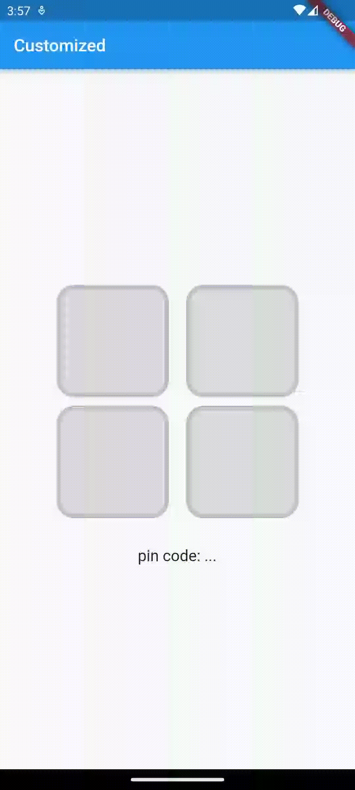

# Flutter Pin Code Fields

 [](https://pub.dev/packages/flutter_pin_code_fields) 

A Flutter package to generate customizable pin code fields.

⭐️ to show support!

## Features
* Highly customizable
* Responsive
* Supports animations
* Supports autofocus
* Supports obscuring text with custom character

# Usage

Add `flutter_pin_code_fields` as a dependency in your `pubspec.yaml` file.

```yaml
# pubspec.yaml

dependencies:
  flutter_pin_code_fields: <latest_version>
```

```dart
import import 'package:flutter_pin_code_fields/flutter_pin_code_fields.dart';

class MyApp extends StatelessWidget {
  @override
  Widget build(BuildContext context) {
    return PinCodeFields(
      onComplete(text) => print(text);
    );
  }
}
```

# Examples

## Basic

Complete example at `example/lib/basic.dart`.


```dart
PinCodeFields(
  onComplete(text) => print(text),
)
```

## Obscuring text

Complete example at `example/lib/obscuring_text.dart`.


```dart
PinCodeFields(
  length: 6,
  obscureText: true,
  obscureCharacter: "🔴",
  onComplete(text) => print(text),
)
```

## Customized

Complete example at `example/lib/customized.dart`.



```dart
PinCodeFields(
  length: 4,
  fieldBorderStyle: FieldBorderStyle.square,
  responsive: false,
  fieldHeight: 130.0,
  fieldWidth: 130.0,
  borderWidth: 5.0,
  activeBorderColor: Colors.blue,
  activeBackgroundColor: Colors.white,
  borderRadius: BorderRadius.circular(20.0),
  keyboardType: TextInputType.number,
  autoHideKeyboard: false,
  fieldBackgroundColor: Colors.black12,
  borderColor: Colors.black12,
  textStyle: TextStyle(
    fontSize: 30.0,
    fontWeight: FontWeight.bold,
  ),
  onComplete(text) => print(text),
)
```

## Animated

Complete example at `example/lib/animated.dart`.


```dart
PinCodeFields(
  obscureText: true,
  obscureCharacter: "❌",
  animation: Animations.rotateRight,
  animationDuration: Duration(milliseconds: 250),
  animationCurve: Curves.bounceInOut,
  switchInAnimationCurve: Curves.bounceIn,
  switchOutAnimationCurve: Curves.bounceOut,
)
```

# Properties
Name | Type | Default | Description
| --- |---|---|---|
length | `int` | 4 | Total number of pin code fields.
margin | `EdgeInsets` | `EdgeInsets.all(5.0)` | Margin between the fields.
padding | `EdgeInsets` | `EdgeInsets.only(bottom: 5.0)` | Padding within the field.
fieldHeight | `double` || Height of the field.
fieldWidth | `double` || Width of the field.
borderWidth | `double` | 2.0 | Width of the border of the field.
borderRadius | `BorderRadius` || Border raduis of the field.
borderColor | `Color` | `Colors.grey`| Border color of the field.
activeBorderColor | `Color` | `Colors.blue`| Border color of the active field.
fieldBorderStyle | `FieldBorderStyle` | `FieldBorderStyle.bottom` | Border styles of the field.
fieldBackgroundColor | `Color` | `Colors.transparent` | Background color of the fields.
activeBackgroundColor | `Color` | `Colors.transparent` | Background color of the active field.
enabled | `bool` | `true` | Enable/ disable editing the fields.
responsive | `bool` | `true` | Adjust the size of the fields automatically to the available space.
autofocus | `bool` | `false` | Enable/ disabled autofocus.
textStyle | `TextStyle` || Text style for the fields.
obscureText | `bool` | `false` | Enable/ disable obscuring the text in the fields.
obscureCharacter | `String` | `*` | Character to obscure the text in the fields.
keyboardType | `TextInputType` | `TextInputType.visiblePassword` | Keyboard type.
autoHideKeyboard | `bool` | `true` | Hides the keyboard automatically on complete.
animation | `Animations` | `Animations.fade` | Animation for the fields.
animationDuration | `Duration` | `Duration(milliseconds: 150)` | Duration of the animation.
animationCurve | `Curve` | `Curves.easeInOut` | Animation curve.
switchInAnimationCurve | `Curve` | `Curves.easeIn` | Switch in animation curve.
switchOutAnimationCurve | `Curve` | `Curves.easeOut` | Switch out animation curve.
controller | `TextEditingController` || Text editing controller for the fields.
focusNode | `FocusNode` || Focus node for the fields.
onChange | `ValueChanged<String>` || Callback that returns text on input.
onComplete [`required`] | `ValueChanged<String>` || Callback that returns text on filling all the fields.
